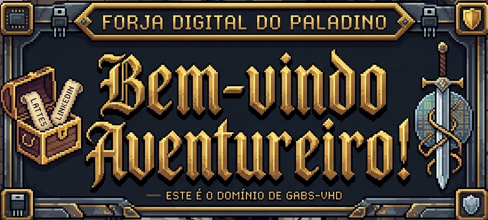
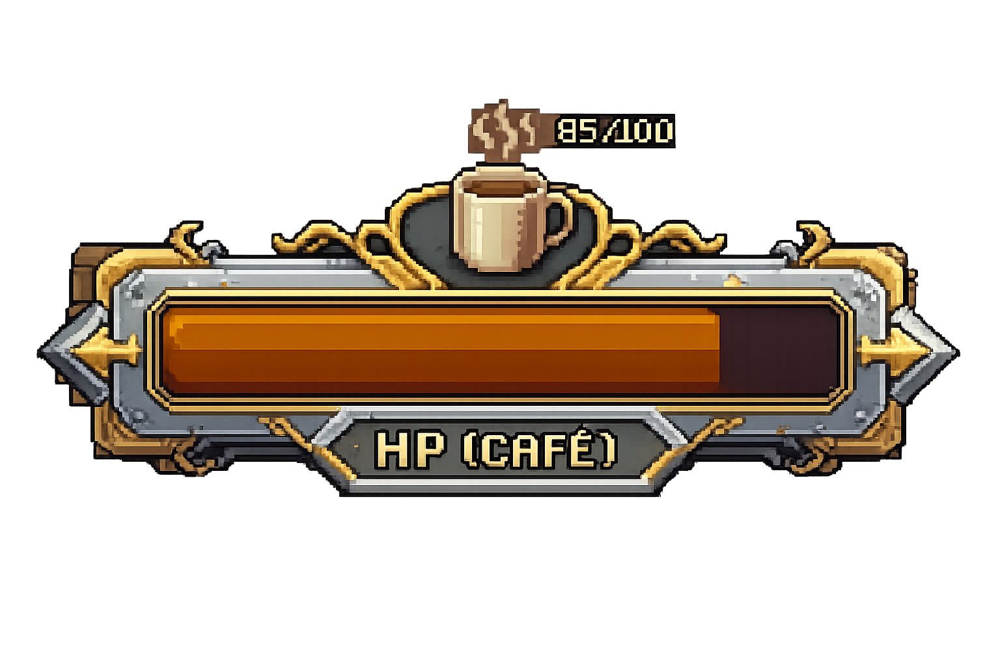
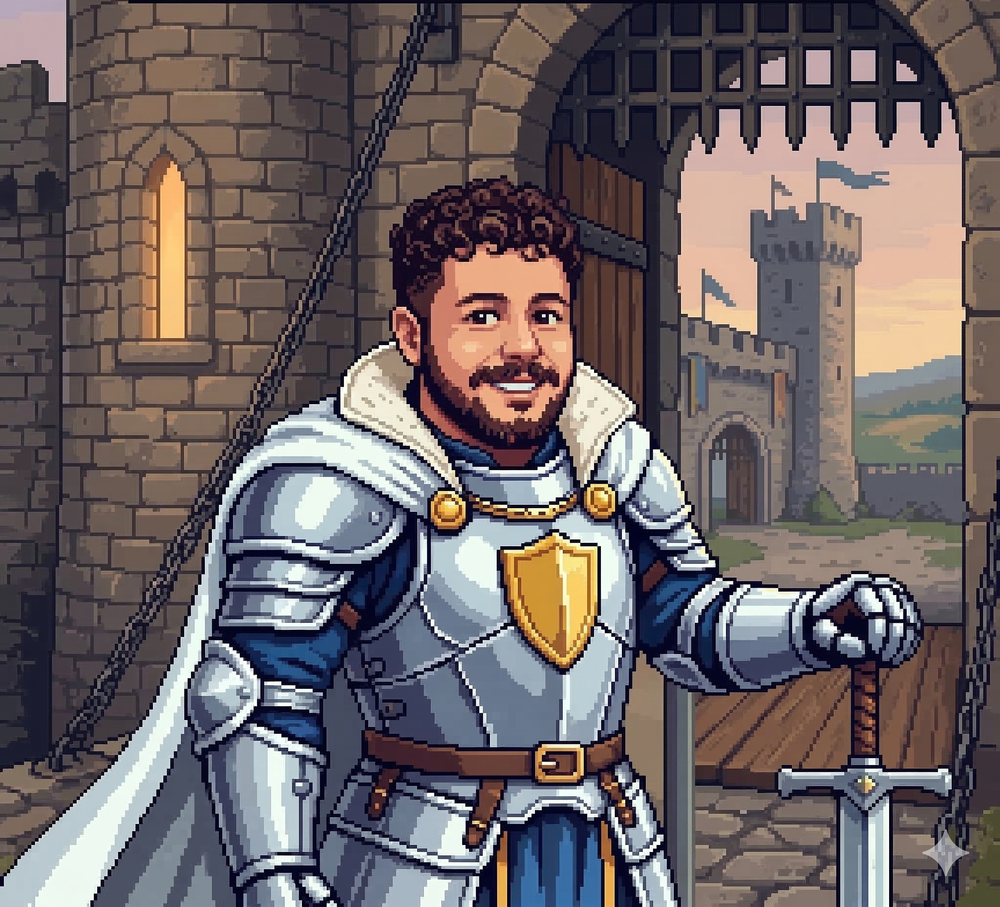
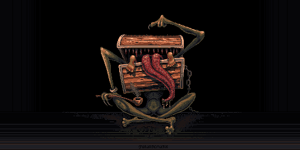

 

  
❤️ <b>HP (Café)</b>

  

  

<table border="0" cellpadding="10" cellspacing="0" align="center">
  <tr>
    <td width="300px" align="center" valign="top">
      
        
      <h3><b>Gabriel Tondolo</b></h3>
      
<i>"Simulando o futuro, um transistor por vez."</i>

      

      

        ⚔️ <b>Classe:</b> Paladino de Hardware 
        🎓 <b>Guilda:</b> UFSM (Eng. Comp.) 
        🔬 <b>Subclasse:</b> Pesquisador de Microeletrônica
      

    </td>

    <td width="500px" valign="top">
      <h2 align="center">📜 Ficha de Atributos</h2>
       
      <h3><b>Habilidades Passivas (Tech Stack)</b></h3>
      

        
        
         
        
        
         
        
      

       
      <h3><b>Pontos de Experiência (GitHub Stats)</b></h3>
      

        
         
        
      

    </td>
  </tr>
</table>

 

  
   
  <b>Cuidado! Baú Mímico detectado guardando Tesouros</b>

